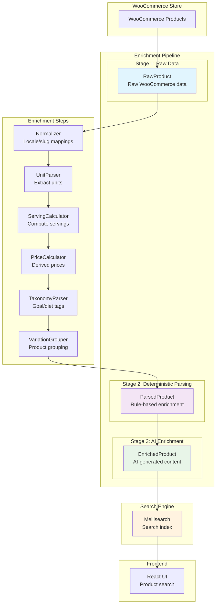
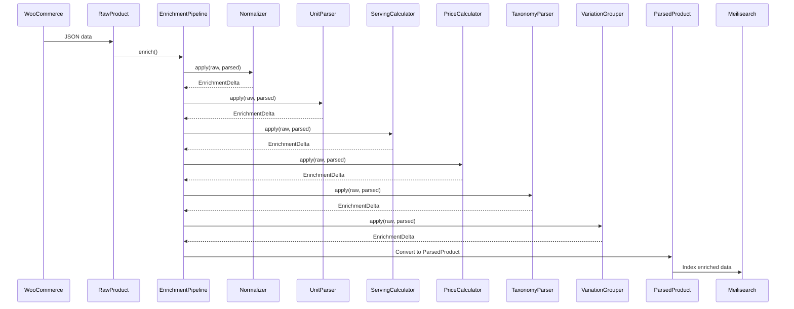

# IronDust Dropshipping Search

A Spring Boot API that ingests WooCommerce Store API data into Meilisearch and provides enriched, searchable product information for [irondust.eu](https://www.irondust.eu).

## 🏗️ Architecture Overview

The system implements a **deterministic-first enrichment pipeline** that transforms raw WooCommerce data into structured, searchable product information. The architecture follows a three-stage data model with comprehensive enrichment capabilities.

### Data Flow Architecture



## 📊 Data Models

### 1. RawProduct
**Purpose**: Initial data structure containing raw WooCommerce data before any processing.

**Key Fields**:
- `id` - Unique identifier (format: `wc_<productId>`)
- `name`, `sku`, `slug` - Basic product information
- `price_cents`, `currency` - Pricing data
- `in_stock`, `low_stock_remaining` - Inventory status
- `categories_ids`, `categories_slugs`, `categories_names` - Category information
- `brand_slug`, `brand_name` - Brand information
- `dynamic_attrs` - WooCommerce product attributes (e.g., `attr_pa_valjalaske-vorm`)
- `search_text` - Concatenated searchable text from name, description, categories

**Source**: Direct mapping from WooCommerce Store API JSON responses.

### 2. ParsedProduct
**Purpose**: Intermediate data structure after deterministic parsing and enrichment.

**Extends RawProduct with**:
- `form` - Normalized product form (`powder`, `capsules`, `tabs`, `drink`, `gel`, `bar`)
- `flavor` - Normalized flavor description (`unflavored`, `citrus`, `berry`, etc.)
- `net_weight_g` - Weight in grams (normalized from various units)
- `servings` - Number of servings per container
- `serving_size_g` - Weight per serving in grams
- `price` - Price in euros (calculated from `price_cents`)
- `price_per_serving` - Price per serving (calculated)
- `price_per_100g` - Price per 100g (calculated)
- `goal_tags` - Fitness/health goals (`preworkout`, `strength`, `endurance`, etc.)
- `diet_tags` - Dietary restrictions (`vegan`, `gluten_free`, `lactose_free`, etc.)
- `ingredients_key` - Key ingredient tokens for search
- `parent_id` - Parent ID for product variations
- `warnings` - Warning messages from enrichment process
- `provenance` - Source tracking for each enriched field

**Source**: Rule-based parsing through enrichment pipeline steps.

### 3. EnrichedProduct
**Purpose**: Final data model for search with AI-generated content and metadata.

**Extends ParsedProduct with**:
- `benefit_snippet` - Short description of product benefits (≤160 chars)
- `faq` - Frequently asked questions and answers
- `synonyms_multi` - Multilingual search synonyms (`en`, `ru`, `et`)
- `safety_flags` - Safety warnings with confidence scores
- `conflicts` - Discrepancies between deterministic and AI values
- `ai_notes` - Optional rationale for AI decisions
- `ai_input_hash` - Hash for idempotency
- `ai_enrichment_ts` - Enrichment timestamp
- `enrichment_version` - Version of enrichment schema

**Source**: AI enrichment (Phase 2) + deterministic parsing (Phase 1).

## 🔄 Enrichment Pipeline

### Pipeline Flow



### Enrichment Steps

#### 1. Normalizer
- **Purpose**: Convert locale-specific values to canonical forms
- **Mappings**: Estonian slugs → English canonical values
- **Examples**: `pulber` → `powder`, `ei-mingit-maitset` → `unflavored`
- **Confidence**: 0.95 (high - from explicit attributes)

#### 2. UnitParser
- **Purpose**: Extract and normalize units from attributes and text
- **Patterns**: Regex for grams, ml, servings, serving sizes
- **Fallbacks**: Text parsing when attributes unavailable
- **Confidence**: 0.95 (attributes) / 0.8 (regex)

#### 3. ServingCalculator
- **Purpose**: Compute servings if missing
- **Formula**: `net_weight_g / serving_size_g`
- **Validation**: Sanity checks (0 < servings ≤ 1000)
- **Confidence**: 0.85 (derived calculation)

#### 4. PriceCalculator
- **Purpose**: Calculate derived price fields
- **Calculations**:
  - `price = price_cents / 100`
  - `price_per_serving = price / servings`
  - `price_per_100g = (price * 100) / net_weight_g`
- **Confidence**: 1.0 (price) / 0.95 (derived)

#### 5. TaxonomyParser
- **Purpose**: Extract goal and diet tags
- **Sources**: Categories, attributes, text patterns
- **Goal Tags**: `preworkout`, `strength`, `endurance`, `lean_muscle`, `recovery`, `weight_loss`, `wellness`
- **Diet Tags**: `vegan`, `gluten_free`, `lactose_free`, `sugar_free`
- **Confidence**: 0.8 (goals) / 0.9 (diets)

#### 6. VariationGrouper
- **Purpose**: Group product variations
- **Strategy**: Brand + normalized base title
- **Output**: `parent_id` for variation grouping
- **Confidence**: 0.8 (heuristic)

## 🚀 Getting Started

### Prerequisites
- Docker and Docker Compose
- Java 21 (for local development)
- Maven (for local development)

### Quick Start
```bash
# Clone the repository
git clone <repository-url>
cd dropshipping-irondust

# Start services
./rebuild-and-watch.sh

# Test enrichment pipeline
curl -X POST http://localhost:4000/ingest/products \
  -H "Content-Type: application/json" \
  -H "x-admin-key: dev_admin_key" \
  -d '{"ids": [31476, 31477]}'

# Search products
curl -X POST http://localhost:4000/search \
  -H "Content-Type: application/json" \
  -d '{"q": "citrulline", "page": 1, "size": 5}'
```

### Services
- **API**: http://localhost:4000
- **Meilisearch**: http://localhost:7700
- **UI**: http://localhost:3000 (if running)

## OpenAPI & Swagger

- OpenAPI JSON: `http://localhost:4000/v3/api-docs`
- OpenAPI YAML: `http://localhost:4000/v3/api-docs.yaml`
- Swagger UI: `http://localhost:4000/swagger-ui.html`

Admin endpoints require header:

```
x-admin-key: dev_admin_key
```

## 📈 Enrichment Results

### Example: MST Citrulline RAW 250g (Product ID: 31476)

**Raw Data**:
- Name: "MST Citrulline RAW 250g Maitsestamata"
- Price: 1890 cents (€18.90)
- Attributes: `pulber-et`, `ei-mingit-maitset`, `250g`, `50 servings`

**Enriched Data**:
- Form: `"powder"` (normalized from `pulber-et`)
- Flavor: `"unflavored"` (normalized from `ei-mingit-maitset`)
- Net weight: `250.0g` (from attributes)
- Servings: `50` (from attributes)
- Price: `18.9€` (calculated)
- Goal tags: `["preworkout", "strength", "wellness", "endurance"]`
- Diet tags: `["vegan"]`
- Parent ID: `"mst-nutrition-mst-citrulline-raw-250g-maitsestamata"`

## 🔧 Configuration

### Environment Variables
```yaml
# Application
app.adminKey: dev_admin_key
app.baseUrl: https://www.irondust.eu
app.perPage: 100
app.indexName: products_lex

# Meilisearch
meili.host: http://127.0.0.1:7700
meili.key: local_dev_key

# Logging
logging.level.com.irondust.search.service.enrichment: DEBUG
```

### Meilisearch Settings
- **Searchable Attributes**: `name`, `search_text`, `sku`, `ingredients_key`
- **Filterable Attributes**: `in_stock`, `categories_slugs`, `brand_slug`, `form`, `diet_tags`, `goal_tags`, `parent_id`
- **Sortable Attributes**: `price_cents`, `price`, `price_per_serving`, `price_per_100g`, `rating`, `review_count`
- **Distinct Attribute**: `parent_id` (for variation grouping)

## 🧪 Testing

### Using HTTP Request Files

The easiest way to test the API is using the provided `.http` files:

- **`api-requests.http`**: Contains all public API endpoints (search, products, ingest, etc.)
- **`admin-requests.http`**: Contains admin-only endpoints (blacklist, raw data, etc.)

These files work with:
- **IntelliJ IDEA / WebStorm** (built-in HTTP client)
- **VS Code** (with REST Client extension)
- **JetBrains HTTP Client** (standalone tool)

See `README-http-files.md` for detailed usage instructions.

### Manual Testing with curl

#### Test Enrichment Pipeline
```bash
# Test specific products
curl -X POST http://localhost:4000/ingest/products \
  -H "Content-Type: application/json" \
  -H "x-admin-key: dev_admin_key" \
  -d '{"ids": [31476, 31477]}'

# Check enriched data
curl -X GET "http://localhost:7700/indexes/products_lex/documents/wc_31476" \
  -H "Authorization: Bearer local_dev_key"
```

#### Monitor Enrichment Logs
```bash
# View enrichment pipeline logs
docker-compose logs api | grep -i "enrich\|pipeline"

# Check for warnings
docker-compose logs api | grep -i "warning\|conflict"
```

## 📋 API Endpoints

### Ingest Endpoints
- `POST /ingest/full` - Ingest all products
- `POST /ingest/products` - Ingest specific products by ID

### Search Endpoints
- `POST /search` - Search products with filters and sorting
- `GET /products/{id}` - Get specific product details

### Health Endpoints
- `GET /health` - Health check
- `GET /health/meili` - Meilisearch health check

## 🧠 Cache Management

The API caches AI enrichment and translations to reduce cost and latency on re-ingests.

- Enrichment cache file: `tmp/ai-enrichment-cache.json`
- Translation cache file: `tmp/translation-cache.json`

Clear caches per request (requires `x-admin-key`) by adding headers to ingest calls:

```bash
curl -X POST http://localhost:4000/ingest/products \
  -H "Content-Type: application/json" \
  -H "x-admin-key: dev_admin_key" \
  -H "x-clear-ai-cache: true" \
  -H "x-clear-translation-cache: true" \
  -d '{"ids": [31476]}'
```

## 🔮 Future Enhancements

### Phase 2: AI Enrichment
- [ ] AI-generated benefit snippets
- [ ] FAQ generation
- [ ] Multilingual synonyms
- [ ] Safety flag detection
- [ ] Conflict resolution

### Phase 3: Vector Search
- [ ] Embedding generation
- [ ] Vector similarity search
- [ ] Hybrid search (BM25 + vectors)
- [ ] Product alternatives

## 📚 Documentation

- `docs/` site powered by MkDocs Material.
- Key pages:
  - `docs/index.md` (Overview)
  - `docs/how-to-run.md` (Getting Started)
  - `docs/architecture.md` (Architecture)
  - `docs/api.md` (API)
  - `docs/localization.md` (Localization)
  - `docs/dev-checklist.md` (Development)

### Run Docs Locally

```bash
# Create and activate a virtualenv (optional but recommended)
python3 -m venv .venv && source .venv/bin/activate

# Documentation is now simple .md files in the docs/ directory
# No server needed - just read the .md files directly

## 🤝 Contributing

1. Fork the repository
2. Create a feature branch
3. Implement changes with tests
4. Submit a pull request

## 📄 License

This project is proprietary software for IronDust.eu.
