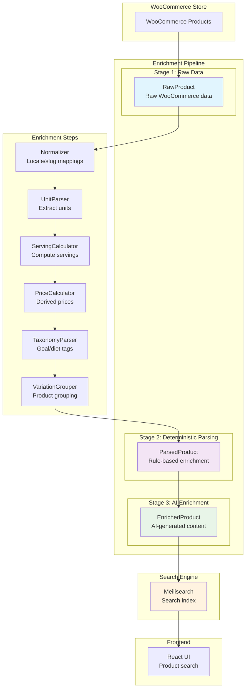

# IronDust-wrapped Dropshipping Search

We’re building a product discovery layer tailored for our drop‑shipping store: a system that turns messy supplier/WooCommerce feeds into a clean, trustworthy, and highly searchable catalog. It standardizes forms, flavors, goals, diets, and brands; computes price intelligence (price per serving/100g); groups variations; and, when confident, adds concise AI content like benefit snippets and FAQs. The result is faster SKU onboarding, filterable browsing that matches shopper intent (goals, diets, in‑stock), and higher conversion/AOV via clear comparisons, alternatives, and complements—without you rewriting supplier data by hand.
We build it deterministic‑first, with optional AI on top. A rule-based pipeline parses units, servings, and prices, extracts taxonomy, and records provenance so deterministic values win; AI is gated by confidence, timeouts, and caching to control cost and latency. The enriched catalog is indexed in Meilisearch (fast lexical) and optionally Qdrant (vectors) for hybrid search that only kicks in when it helps. Feature flags let you toggle AI and hybrid behavior, admin endpoints handle ingest/reindex, and the storefront consumes simple APIs for search, product detail, alternatives, and complements—all designed to handle supplier volatility and keep operations lean.


## Architecture at a Glance



## Quick Start

```bash
./rebuild-and-watch.sh
```

Once running: API http://localhost:4000, Meilisearch http://localhost:7700.
Admin UI: http://localhost:4000/admin-ui (Basic Auth; defaults admin/admin)

## Next Steps

- See Getting Started for local setup details
- Explore the Architecture for enrichment and indexing design
- Use the API reference to ingest and search

### What’s new

- Admin UI: trigger reingest/reindex, live logs via SSE, feature flag toggles
- AI enrichment adds benefit snippet, FAQs, synonyms, goal scores
- AI dosage/timing extraction: concise `dosage_text` and `timing_text` with `*_i18n` localization used by the PDP UI


