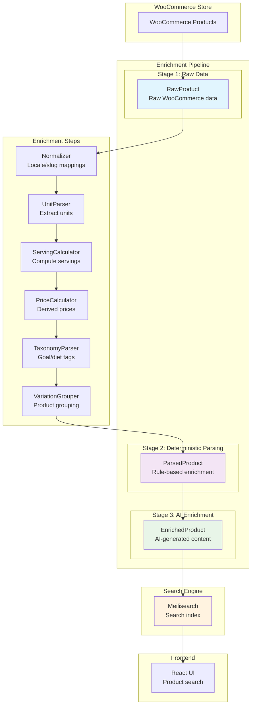

# IronDust Dropshipping Search

Spring Boot API that ingests WooCommerce Store API data into Meilisearch and provides enriched, searchable product information for irondust.eu.

## Architecture at a Glance



## Quick Start

```bash
./rebuild-and-watch.sh
```

Once running: API http://localhost:4000, Meilisearch http://localhost:7700.

## Next Steps

- See Getting Started for local setup details
- Explore the Architecture for enrichment and indexing design
- Use the API reference to ingest and search


